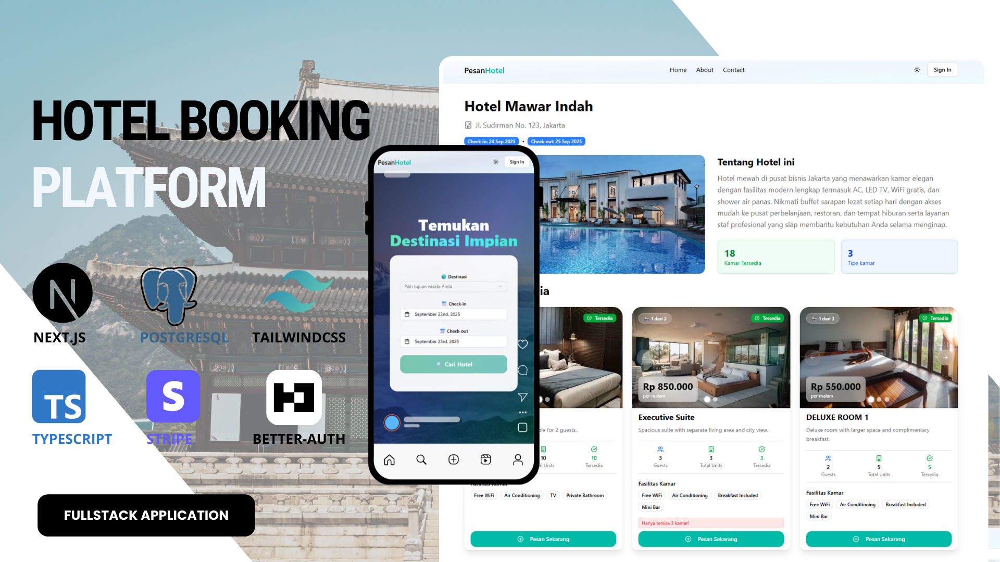

# 🏨 Hotel Booking Application

A comprehensive fullstack hotel booking platform built with Next.js, Prisma, and PostgreSQL. This application provides a complete hotel management system with role-based access control, featuring both customer booking capabilities and administrative hotel management tools.

The platform supports real-time hotel searches, room availability checking, secure booking processes, payment integration with Stripe, and automated email notifications. With separate interfaces for customers and administrators, it streamlines the entire hotel booking experience from search to payment confirmation.

---

## 1. Project Overview

This hotel booking application was developed to provide a modern, efficient solution for hotel businesses and customers. Traditional booking systems often lack flexibility, real-time availability checking, and integrated payment processing. This platform addresses these challenges by offering a unified system that handles hotel management, room bookings, payments, and customer communications.

The application became a comprehensive solution for managing hotel operations, enabling administrators to oversee multiple hotels, room inventories, booking confirmations, and revenue tracking while providing customers with an intuitive booking experience.

## 2. Project Requirements

- Enable customers to search and book hotel rooms based on location, dates, and preferences
- Support real-time room availability checking and booking conflict prevention
- Implement role-based dashboards (customer, admin) with appropriate access controls
- Handle secure payment processing through Stripe integration
- Provide automated email notifications for booking confirmations and updates
- Include comprehensive admin dashboard with analytics and hotel management tools

## 3. The Challenge

The main challenge was designing a booking system that could handle real-time room availability, prevent double bookings, and manage complex relationships between hotels, rooms, bookings, and payments. The application needed to support multiple hotels with varying room types, dynamic pricing, and automated booking confirmations while maintaining data consistency and user security.

## 4. The Approach & Solution

I built a fullstack web application using Next.js 15 with the App Router for the frontend and Prisma with PostgreSQL for the backend. The system features a robust booking engine with availability checking, conflict detection, and automated invoice generation. Users can search hotels by location and dates, book rooms with real-time availability, and complete payments through Stripe. Administrators have access to comprehensive hotel management tools including room inventory, booking oversight, and revenue analytics.

## 5. Key Features

- **Better Auth Authentication** – Secure authentication with email/password and OAuth (Google, GitHub) integration

- **Real-time Room Availability** – Dynamic availability checking with booking conflict prevention

- **Advanced Search & Filtering** – Hotel search by location, dates, price range, and amenities

- **Secure Payment Processing** – Stripe integration for credit card payments with automated invoice generation

- **Role-Based Access Control** – Separate interfaces for customers (USER) and administrators (ADMIN)

- **Comprehensive Admin Dashboard** – Real-time analytics, revenue tracking, and hotel performance monitoring

- **Hotel & Room Management** – Complete CRUD operations for hotels, rooms, and room types

- **Booking Management System** – Status tracking (PENDING, CONFIRMED, CANCELLED, COMPLETED)

- **Automated Email Notifications** – Booking confirmations and password reset emails via Nodemailer

- **File Upload Integration** – EdgeStore integration for hotel and room image management

- **Responsive Design** – Mobile-first approach with TailwindCSS and Radix UI components

- **Database Backup & Cron Jobs** – Automated data backup to Google Sheets and maintenance tasks

## 6. Tech Stack

### 6.1 Frontend

- **Next.js 15** with **App Router** (React 19)
- **TailwindCSS 4.1** + **Radix UI** + **ShadCN UI**
- **React Hook Form + Zod** (form validation)
- **TanStack React Query** (data fetching and caching)
- **Better Auth** (authentication)
- **EdgeStore** (file uploads)
- **Recharts** (dashboard analytics)
- **TypeScript** (type safety)

### 6.2 Backend

- **Next.js API Routes** (serverless functions)
- **Prisma ORM** (database management)
- **PostgreSQL** (main database)
- **Better Auth** (authentication & session management)
- **Stripe** (payment processing)
- **Nodemailer** (email notifications)
- **Google Sheets API** (data backup)

### 6.3 Deployment

- **Vercel** (frontend hosting)
- **Neon/Railway/Supabase** (PostgreSQL hosting)
- **EdgeStore** (file storage)
- **Stripe** (payment gateway)

---

## 7. Project Structure

### 7.1 Frontend Structure

```
app/
├── (auth)/                         # Authentication pages
│   ├── signin/
│   ├── signup/
│   ├── forgot-password/
│   └── reset-password/
├── (public)/                       # Public pages for customers
│   ├── page.tsx                    # Homepage
│   ├── about/
│   ├── contact/
│   └── hotels/                     # Hotel listing and details
├── admin/                          # Admin panel pages
│   ├── page.tsx                    # Admin dashboard
│   ├── hotels/                     # Hotel management
│   ├── bookings/                   # Booking management
│   └── payments/                   # Payment tracking
├── user/                           # Customer portal
│   ├── page.tsx                    # User dashboard
│   ├── bookings/                   # User bookings
│   ├── payments/                   # Payment history
│   └── profile/                    # Profile management
└── api/                           # API routes
    ├── auth/[...all]/             # Better Auth endpoints
    ├── admin/                     # Admin API endpoints
    ├── user/                      # User API endpoints
    ├── bookings/                  # Booking operations
    ├── cron/                      # Scheduled tasks
    └── webhook/                   # External webhooks

components/
├── admin/                         # Admin-specific components
├── auth/                          # Authentication components
├── form-fields/                   # Reusable form inputs
├── form-control/                  # Form utilities
├── home/                          # Homepage components
├── hotel-detail/                  # Hotel detail components
├── hotels/                        # Hotel listing components
├── shared/                        # Shared components
├── ui/                           # Base UI components (ShadCN)
└── user/                         # User-specific components

lib/
├── actions/                       # Server actions
│   ├── admin.ts                   # Admin operations
│   ├── bookings.ts                # Booking logic
│   ├── hotels.ts                  # Hotel operations
│   └── my.ts                      # User operations
├── types/                         # TypeScript definitions
├── auth.ts                        # Better Auth configuration
├── prisma.ts                      # Prisma client
├── mailer.ts                      # Email service
└── utils.ts                       # Utility functions

hooks/
├── use-bookings.ts                # Booking hooks
├── use-dashboard.ts               # Dashboard data hooks
├── use-hotels.ts                  # Hotel data hooks
├── use-payments.ts                # Payment hooks
└── use-rooms.ts                   # Room data hooks
```

### 7.2 Database Schema

```
Models:
├── User                           # User accounts with roles
├── Profile                        # Extended user profiles
├── Hotel                          # Hotel information
├── Room                           # Hotel rooms
├── RoomType                       # Room categories
├── RoomImage                      # Room photos
├── Booking                        # Room reservations
├── Payment                        # Payment transactions
├── Session                        # User sessions
├── Account                        # OAuth accounts
└── Verification                   # Email verification
```

---

## 8. Authentication & Authorization

- **Better Auth Integration** – Modern authentication with email/password and OAuth providers
- **Email Verification** – Required email verification for new accounts with automated emails
- **Password Reset** – Secure password reset flow with email links
- **OAuth Support** – Google and GitHub sign-in integration
- **Role-Based Middleware** – Route protection based on user roles (USER/ADMIN)
- **Session Management** – Secure session handling with automatic token refresh

---

## 9. API Features & Endpoints

### 9.1 Authentication

| Method | Endpoint                  | Description            |
| ------ | ------------------------- | ---------------------- |
| POST   | /api/auth/sign-in         | User sign in           |
| POST   | /api/auth/sign-up         | User registration      |
| POST   | /api/auth/sign-out        | User sign out          |
| GET    | /api/auth/session         | Get current session    |
| POST   | /api/auth/forgot-password | Password reset request |
| POST   | /api/auth/reset-password  | Reset password         |
| GET    | /api/auth/verify-email    | Email verification     |

### 9.2 Hotels (Public)

| Method | Endpoint         | Description                |
| ------ | ---------------- | -------------------------- |
| GET    | /api/hotels      | Search hotels with filters |
| GET    | /api/hotels/\:id | Get hotel details          |

### 9.3 Rooms

| Method | Endpoint         | Description                 |
| ------ | ---------------- | --------------------------- |
| GET    | /api/rooms       | Get rooms with availability |
| GET    | /api/rooms/\:id  | Get room details            |
| GET    | /api/rooms/types | Get room types              |

### 9.4 Bookings

| Method | Endpoint                | Description         |
| ------ | ----------------------- | ------------------- |
| POST   | /api/bookings           | Create new booking  |
| GET    | /api/user/bookings      | Get user bookings   |
| GET    | /api/user/bookings/\:id | Get booking details |

### 9.5 Payments

| Method | Endpoint            | Description              |
| ------ | ------------------- | ------------------------ |
| GET    | /api/user/payments  | Get user payment history |
| POST   | /api/webhook/stripe | Stripe webhook handler   |

### 9.6 Admin - Hotels

| Method | Endpoint               | Description               |
| ------ | ---------------------- | ------------------------- |
| GET    | /api/admin/hotels      | Get all hotels (admin)    |
| POST   | /api/admin/hotels      | Create hotel (admin)      |
| GET    | /api/admin/hotels/\:id | Get hotel details (admin) |
| PUT    | /api/admin/hotels/\:id | Update hotel (admin)      |
| DELETE | /api/admin/hotels/\:id | Delete hotel (admin)      |

### 9.7 Admin - Rooms

| Method | Endpoint              | Description              |
| ------ | --------------------- | ------------------------ |
| GET    | /api/admin/rooms      | Get all rooms (admin)    |
| POST   | /api/admin/rooms      | Create room (admin)      |
| GET    | /api/admin/rooms/\:id | Get room details (admin) |
| PUT    | /api/admin/rooms/\:id | Update room (admin)      |
| DELETE | /api/admin/rooms/\:id | Delete room (admin)      |

### 9.8 Admin - Bookings

| Method | Endpoint                 | Description                 |
| ------ | ------------------------ | --------------------------- |
| GET    | /api/admin/bookings      | Get all bookings (admin)    |
| GET    | /api/admin/bookings/\:id | Get booking details (admin) |
| PUT    | /api/admin/bookings/\:id | Update booking (admin)      |

### 9.9 Admin - Payments

| Method | Endpoint                 | Description                 |
| ------ | ------------------------ | --------------------------- |
| GET    | /api/admin/payments      | Get all payments (admin)    |
| GET    | /api/admin/payments/\:id | Get payment details (admin) |

### 9.10 Admin - Dashboard

| Method | Endpoint             | Description              |
| ------ | -------------------- | ------------------------ |
| GET    | /api/admin/dashboard | Get dashboard statistics |

### 9.11 Cron Jobs

| Method | Endpoint                           | Description                  |
| ------ | ---------------------------------- | ---------------------------- |
| POST   | /api/cron/database-backup          | Backup data to Google Sheets |
| POST   | /api/cron/cleanup-unverified-users | Remove unverified users      |
| POST   | /api/cron/update-payments-status   | Update payment statuses      |

---

## 10. Configuration

### 10.1 Environment Variables

```env
# Database
DATABASE_URL=your-postgresql-connection-string

# Better Auth
NEXT_BETTER_AUTH_SECRET=your-auth-secret
NEXT_PUBLIC_APP_URL=http://localhost:3000

# OAuth Providers
NEXT_GOOGLE_CLIENT_ID=your-google-client-id
NEXT_GOOGLE_CLIENT_SECRET=your-google-client-secret
NEXT_GITHUB_CLIENT_ID=your-github-client-id
NEXT_GITHUB_CLIENT_SECRET=your-github-client-secret

# Email Service (Nodemailer)
EMAIL_FROM=your-email@domain.com
EMAIL_USER=your-smtp-username
EMAIL_PASS=your-smtp-password
EMAIL_HOST=your-smtp-host
EMAIL_PORT=587

# Stripe Payment
STRIPE_SECRET_KEY=your-stripe-secret-key
NEXT_PUBLIC_STRIPE_PUBLISHABLE_KEY=your-stripe-publishable-key
STRIPE_WEBHOOK_SECRET=your-stripe-webhook-secret

# EdgeStore (File Upload)
EDGE_STORE_ACCESS_KEY=your-edgestore-access-key
EDGE_STORE_SECRET_KEY=your-edgestore-secret-key

# Google Sheets API (Backup)
GOOGLE_SERVICE_ACCOUNT_EMAIL=your-service-account@project.iam.gserviceaccount.com
GOOGLE_PRIVATE_KEY=your-google-private-key
GOOGLE_SHEET_ID=your-google-sheet-id

# Verification URLs
NEXT_VERIFICATION_URL=http://localhost:3000
```

## 11. Deployment

### 11.1 Vercel Deployment (Recommended)

1. **Connect your repository to Vercel**

   - Push your code to GitHub/GitLab
   - Import project in Vercel dashboard

2. **Configure environment variables**

   - Add all required environment variables in Vercel dashboard
   - Set production URLs for callbacks and webhooks

3. **Database setup**

   - Use Neon, Railway, or Supabase for PostgreSQL
   - Run migrations: `npx prisma migrate deploy`
   - Seed database if needed: `npx prisma db seed`

4. **Deploy**
   ```bash
   git push origin main
   ```

### 11.2 Local Development

1. **Clone the repository**

   ```bash
   git clone <your-repo-url>
   cd hotel-booking-app
   ```

2. **Install dependencies**

   ```bash
   npm install
   ```

3. **Set up environment variables**

   ```bash
   cp .env.example .env.local
   # Fill in your environment variables
   ```

4. **Set up database**

   ```bash
   npx prisma migrate dev
   npx prisma db seed
   ```

5. **Run development server**

   ```bash
   npm run dev
   ```

6. **Open in browser**
   ```
   http://localhost:3000
   ```

## 12. Database Setup

### 12.1 Prisma Configuration

```bash
# Generate Prisma client
npx prisma generate

# Run migrations
npx prisma migrate dev --name init

# Reset database (development only)
npx prisma migrate reset

# View database in Prisma Studio
npx prisma studio
```

### 12.2 Seed Data

The application includes seed data for:

- Sample hotels and rooms
- Room types (Standard, Deluxe, Suite)
- Admin user account
- Sample bookings and payments

```bash
npx prisma db seed
```

## 13. Features Deep Dive

### 13.1 Booking System

- **Real-time Availability**: Checks room availability in real-time during search
- **Conflict Prevention**: Prevents double booking through database constraints
- **Dynamic Pricing**: Supports different pricing based on room type and season
- **Booking Status Flow**: PENDING → CONFIRMED → COMPLETED/CANCELLED

### 13.2 Payment Integration

- **Stripe Checkout**: Secure payment processing with Stripe
- **Automatic Invoicing**: Generates unique invoice numbers
- **Payment Tracking**: Real-time payment status updates via webhooks
- **Refund Support**: Admin can process refunds through Stripe dashboard

### 13.3 Admin Dashboard

- **Revenue Analytics**: Monthly revenue trends and growth metrics
- **Booking Statistics**: Status distribution and monthly trends
- **Hotel Performance**: Top performing hotels by revenue and occupancy
- **User Management**: User growth tracking and activity monitoring

### 13.4 Email Notifications

- **Booking Confirmations**: Automated emails for successful bookings
- **Payment Receipts**: Email receipts for completed payments
- **Account Verification**: Email verification for new registrations
- **Password Reset**: Secure password reset links

## 14. Contributing

Contributions are welcome! To contribute:

1. **Fork the repository**

   ```bash
   git fork <repo-url>
   ```

2. **Create a feature branch**

   ```bash
   git checkout -b feature/your-feature-name
   ```

3. **Make your changes**

   - Follow the existing code style
   - Add tests if applicable
   - Update documentation

4. **Commit your changes**

   ```bash
   git commit -m "feat: add new feature"
   ```

5. **Push and create PR**
   ```bash
   git push origin feature/your-feature-name
   ```

## 15. License

This project is licensed under the MIT License. Feel free to use, modify, and distribute it for personal or commercial purposes.

**MIT License**

Copyright (c) 2024 Hotel Booking App

Permission is hereby granted, free of charge, to any person obtaining a copy of this software and associated documentation files (the "Software"), to deal in the Software without restriction, including without limitation the rights to use, copy, modify, merge, publish, distribute, sublicense, and/or sell copies of the Software, and to permit persons to whom the Software is furnished to do so, subject to the following conditions:

The above copyright notice and this permission notice shall be included in all copies or substantial portions of the Software.

THE SOFTWARE IS PROVIDED "AS IS", WITHOUT WARRANTY OF ANY KIND, EXPRESS OR IMPLIED, INCLUDING BUT NOT LIMITED TO THE WARRANTIES OF MERCHANTABILITY, FITNESS FOR A PARTICULAR PURPOSE AND NONINFRINGEMENT. IN NO EVENT SHALL THE AUTHORS OR COPYRIGHT HOLDERS BE LIABLE FOR ANY CLAIM, DAMAGES OR OTHER LIABILITY, WHETHER IN AN ACTION OF CONTRACT, TORT OR OTHERWISE, ARISING FROM, OUT OF OR IN CONNECTION WITH THE SOFTWARE OR THE USE OR OTHER DEALINGS IN THE SOFTWARE.

---

## About

This hotel booking application demonstrates modern web development practices using Next.js, Prisma, and PostgreSQL. It showcases full-stack development capabilities including authentication, payment processing, real-time data updates, and comprehensive admin functionality.

**Built with ❤️ using Next.js 15 and modern web technologies**

- 📧 **Contact**: [ahmadfiqrioemry@gmail.com]
- 🌐 **Live Demo**: [https://pesanhotel.showcasepreview.my.id]
- 📱 **GitHub**: [https://github.com/fiqrioemry/nextjs-prisma-hotel-booking-app.git]
